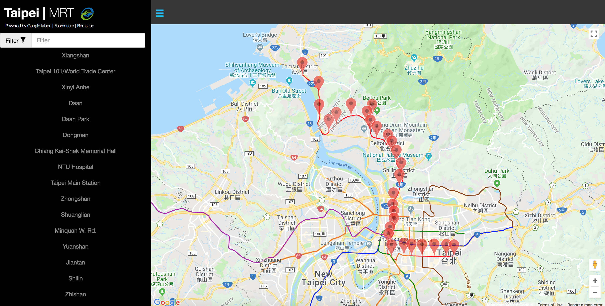
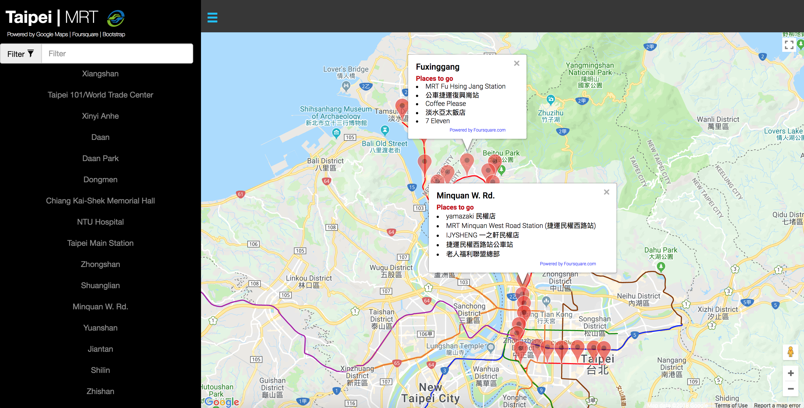
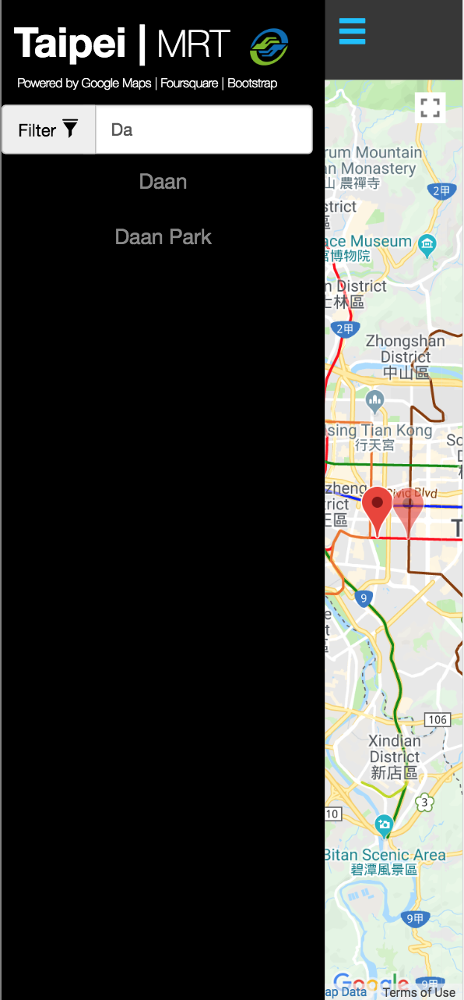
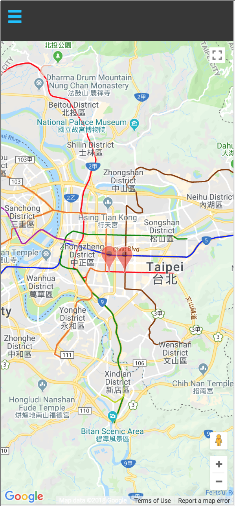

# Neighborhood Map | Taipei Metro System (Taipei MRT)
This is a Single-Page Application that lets people search/filter Taipei Metro stations (currently Tamsui line 淡水線) and see five interesting places to go nearby the station. This SPA uses KnockoutJS as the MVVM library and is powered by Google Maps, Foursquare and Bootstrap.

## Usage
1. Git clone or fork this repo.

2. In the `index.html` file, replace `GOOGLE_MAP_API_KEY` with your Google Maps API key.
```html
<script async defer src="https://maps.googleapis.com/maps/api/js?key=GOOGLE_MAP_API_KEY&callback=initMap"></script>
```

3. In the `js/app.js` file, replace `CLIENT_ID` and `CLIENT_SECRET` with your Foursquare Client ID and client Secret respectively.
```javascript
const FOUR_SQUARE_CLIENT_ID = 'CLIENT_ID';
const FOUR_SQUARE_CLIENT_SECRET = 'CLIENT_SECRET';
```

4. Open/Run index.html in your browser.

## Application Features
Clean UI with a menu section that users can search/filter the station by name


Info windows and nearby places information


Responsive design for mobile phones (iPhone X)<br>
&emsp;

Real-time filtering the stations by name and resizing the map to fit the boundary


Showing info windows when users click on the list or the markers
